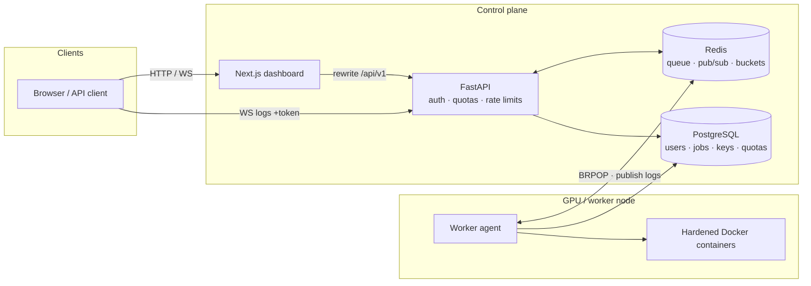

# Perzforge

**A self-hosted ML platform built from scratch on personal GPU hardware — job scheduling, hardened container execution, live log streaming, and multi-user security.**

Think of it as a miniature SageMaker + a slice of EC2, running on a gaming laptop, reachable over a private [Tailscale](https://tailscale.com) mesh (or localhost during development). Built solo, story by story, against a written PRD and architecture spec.

---

## Why this exists

Cloud platforms teach you to *consume* infrastructure. I wanted to *build* it: the queue, the scheduler, the sandbox, the auth system, the rate limiter — every layer that AWS abstracts away, implemented and understood from first principles. The result runs ML experiments today and doubles as a documentation-first engineering project.

## MVP shipped (Phase 1)

Stories implemented and tested end to end:

| Epic | Stories | What landed |
|------|---------|-------------|
| **A — Auth** | A1, A2, A3 | Invite-only admin users, forced password rotation, JWT + rotating refresh cookies, scoped API keys |
| **B — Jobs** | B1, B2, B3, B5 | Submit/list/get jobs, Redis queue, hardened Docker worker, live WebSocket logs, cooperative cancel |
| **E — Limits** | E1, E2 | Per-user quotas, Lua token-bucket rate limits with `X-RateLimit-*` / `Retry-After` |
| **F — UI** | F1 | Next.js operator dashboard (jobs, live logs, keys, quota) |

**Not in MVP yet** (specced, not built): MinIO/MLflow model registry, model/LLM serving, Incus instances, Wake-on-LAN, audit-log UI — see [Roadmap](#roadmap).

## What works today

### ML job platform
- REST API for job submission — strict Pydantic specs (`extra="forbid"`), image allow-list prefixes, argv-only commands (no shell strings)
- Redis-queued scheduler with Postgres commit → enqueue handoff (enqueue failure marks the job `FAILED`)
- GPU execution via Docker `device_requests` (optional per job)
- Live log streaming: Redis pub/sub → authenticated WebSockets, with a capped replay buffer on reconnect
- Cooperative cancellation (`CANCELLING` → `CANCELLED`) with a Redis control channel
- Worker self-healing: orphaned `RUNNING` jobs are reaped on startup; a Redis heartbeat lock keeps one writer per node

### Hardened execution sandbox
Every job container runs with:
`cap_drop=ALL` · `no-new-privileges` · non-root UID · read-only root FS · `network_mode=none` · memory/CPU/PID ceilings · enforced timeouts

### Multi-user security
- JWT access tokens + httpOnly rotating refresh cookies — replaying a used refresh token revokes the token family
- Scoped API keys (`pzf_…`): SHA-256 hashed at rest, plaintext revealed once, soft-revoke
- Invite-only accounts; temporary passwords force `/change-password` before other routes
- Per-user quota engine (concurrent jobs, daily jobs, storage, instances, LLM tokens)
- Atomic Lua token-bucket rate limiting (identity: API key → JWT → IP); fail-open only on Redis outage
- Ownership checks on every object fetch — foreign resources return **404**, not 403

### Dashboard (F1)
Next.js 15 App Router UI in [`web/`](web/):
- Login + forced password-change flow
- Jobs list (5s poll) · new job form · job detail with live logs (pause / reconnect indicator) · cancel
- API keys with single-reveal copy modal
- My quota usage bars
- Typed client in `web/lib/api.ts`; HTTP proxied via Next rewrites; WebSockets go to the API (`NEXT_PUBLIC_WS_BASE`)

### Networking
- **Dev:** API/dashboard/DB/Redis bind to localhost (Compose publishes `127.0.0.1` only).
- **Remote:** Tailscale (or similar) to reach the same ports without opening the host firewall to the public internet.

## Architecture



**Job lifecycle:** `POST /jobs` → auth + quota check → Postgres row → Redis enqueue → worker BRPOP → hardened container → logs via pub/sub to WebSocket clients → terminal status + exit code.

## Design decisions worth defending

- **Worker polls; control plane never pushes.** Survives blips and a GPU node that sleeps. The queue is the contract.
- **Enqueue after commit, reconcile on failure.** Postgres and Redis cannot silently diverge.
- **404 over 403 for foreign objects.** IDOR probing learns nothing about existence.
- **Rate limiting is a Lua script**, not check-then-set — race-free under concurrency.
- **Fail closed by default.** Every route has an explicit auth dependency (public routes marked `# public: …`).
- **Quotas in the API, not in trust.** Safe to share because limits are code.

## Stack

| Layer | Choice |
|-------|--------|
| API | Python 3.12, FastAPI, Pydantic v2, SQLAlchemy 2.x async + asyncpg |
| Data | PostgreSQL 17, Redis 7 |
| Worker | Docker SDK for Python (no `shell=True`) |
| UI | Next.js 15, TypeScript, Tailwind |
| Auth | PyJWT, Argon2id (`argon2-cffi`) |
| Migrations | Alembic (one migration per schema story) |

Full rationale: [`docs/ARCHITECTURE.md`](docs/ARCHITECTURE.md). Rules for contributors/agents: [`AGENTS.md`](AGENTS.md).

## Docs

- [PRD](docs/PRD.md) — user stories & acceptance criteria
- [Architecture](docs/ARCHITECTURE.md) — components, data model, API, security
- [Phase 0 setup](docs/PHASE0-SETUP.md) — GPU node / Docker notes
- [AGENTS.md](AGENTS.md) — non-negotiable implementation rules
- Story task files in [`tasks/`](tasks/) (A1–A3, B1–B5, E1–E2, F1)

## Quickstart (dev)

You need **three processes** after Postgres/Redis are up: **API**, **worker**, **dashboard**.

### 1. Bootstrap (once)

```bash
cp .env.example .env
# Set JWT_SECRET (e.g. openssl rand -hex 32) and ADMIN_EMAIL / ADMIN_PASSWORD

docker compose up -d          # Postgres + Redis on 127.0.0.1:5432 / :6379

python -m venv .venv
# Windows: .\.venv\Scripts\Activate.ps1
# Unix:    source .venv/bin/activate
pip install -r requirements.txt
alembic upgrade head

# First admin (only when none exists yet)
# Windows PowerShell:
#   $env:ADMIN_EMAIL="admin@example.com"; $env:ADMIN_PASSWORD="your-long-password"
# Unix:
#   export ADMIN_EMAIL=admin@example.com ADMIN_PASSWORD='your-long-password'
python scripts/create_admin.py
```

Keep `ALLOWED_IMAGE_PREFIXES` in `.env` in sync with images you intend to run (defaults include `python:`, `pytorch/`, `tensorflow/`, `nvidia/cuda`, `ubuntu:`). The dashboard dropdown is a curated subset in `web/lib/types.ts`.

### 2. API (terminal 1)

```bash
uvicorn api.main:app --reload --host 127.0.0.1 --port 8000
```

- Health: http://127.0.0.1:8000/api/v1/healthz  
- OpenAPI: http://127.0.0.1:8000/api/v1/docs  

### 3. Worker (terminal 2)

Docker must be running. GPU jobs also need the NVIDIA Container Toolkit.

```bash
python -m worker.agent
```

Without the worker, jobs stay `QUEUED`. Large images (e.g. CUDA) are pulled on first use — the UI may show “Waiting for log lines…” until the container starts; progress during pull is not streamed yet.

### 4. Dashboard (terminal 3)

```bash
cd web
cp .env.example .env.local   # leave NEXT_PUBLIC_API_BASE empty (same-origin rewrite)
npm install
npm run dev                  # http://localhost:3000
```

From the repo root you can also run `npm run dev` (forwards into `web/`).

| Variable | Purpose |
|----------|---------|
| `NEXT_PUBLIC_API_BASE` | Leave empty so the browser calls `/api/v1/*` on the Next origin (rewritten to FastAPI). Do **not** set a bare `host:port` — that becomes a relative URL and 404s. |
| `API_PROXY_TARGET` | Where Next rewrites HTTP (default `http://127.0.0.1:8000`). |
| `NEXT_PUBLIC_WS_BASE` | WebSocket origin for live logs (default `ws://127.0.0.1:8000`). If you open the UI via Tailscale, point this at the API host (e.g. `ws://100.x.y.z:8000`). |

Optional Compose dashboard (API must already be reachable from the container):

```bash
docker compose --profile web up -d --build web
```

### Ports

| Service | Address |
|---------|---------|
| PostgreSQL | `127.0.0.1:5432` |
| Redis | `127.0.0.1:6379` |
| FastAPI | `127.0.0.1:8000` |
| Next.js | `127.0.0.1:3000` |

## Tests

```bash
# API / worker (needs Postgres + Redis)
pytest -m "not integration"

# Dashboard unit tests
cd web && npm test

# Optional Playwright smoke (API + web up, real user):
# PLAYWRIGHT_BASE_URL=http://127.0.0.1:3000 E2E_EMAIL=... E2E_PASSWORD=... npx playwright test
```

Every backend user story ships with pytest coverage mapped to its acceptance criteria.

## How it was built

Documentation-first: the [PRD](docs/PRD.md) defines stories with testable acceptance criteria; [ARCHITECTURE](docs/ARCHITECTURE.md) freezes design; [`AGENTS.md`](AGENTS.md) encodes non-negotiable rules (auth on every route, ownership checks, no `shell=True`, tests per criterion). Implementation was AI-assisted under those constraints; auth, tokens, quotas, and container execution are flagged for human review.

## Roadmap

Next, in roughly this order ([`tasks/11-phase2-preview.md`](tasks/11-phase2-preview.md)):

- **B4** — MinIO artifacts + model registry rows + MLflow tracking URI in jobs
- **C1–C3** — model deploy, Ollama OpenAI-compatible proxy, token metering
- **B6** — Wake-on-LAN when the queue has work and the worker is offline
- **E3** — append-only audit log + admin viewer
- **D1–D3** — Incus compute instances
- **G1** — exoplanet / TESS pipeline as the platform’s own acceptance test

## Status

Phase 1 MVP is closed: auth → quotas → rate limits → submit job → worker runs it → live logs → dashboard. This is a learning-first personal platform on a laptop, not a multi-tenant SaaS — uptime and hardware constraints are part of the design.
